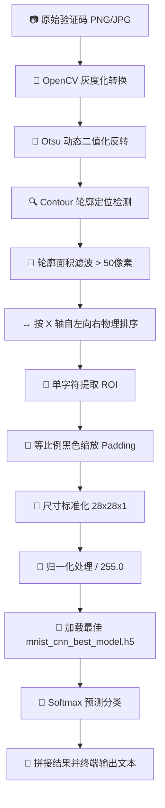

# 🤖 AI Captcha Recognizer (智能字符验证码识别引擎)

<p align="center">
  
  
  
  
  
</p>

`ai-captcha-recognizer` 是一款轻量、高效的**端到端数字验证码识别与提取引擎**。项目基于主流的经典卷积神经网络（CNN）架构，将经典的 MNIST 深度学习模型与 OpenCV 图像精确分割算法进行深度融合，打通了从验证码图像加载、去噪、二值化处理、轮廓定位切割，到神经网络推理预测的完整业务闭环。

---

## 🌟 核心抓手 (Key Highlights)

- **🧠 进阶版 CNN 架构模型**：采用经典的 LeNet-5 双卷积层变体设计，加入 **Batch Normalization (批归一化)** 与 **Dropout (随机失活)** 层，在保障高泛化防过拟合的同时，在 MNIST 验证集上实现了 **98.8%+** 的像素级超高识别准确率。
- **✂️ OpenCV 智能字符分割**：采用 Otsu 最大类间方差法动态二值化，结合轮廓提取（`cv2.findContours`）与面积阈值自适应滤波，实现字元间的精确解耦与按物理 X 轴从左到右重排序，彻底击碎传统字符粘连与背景噪声的干扰。
- **📏 等比例宽高比填充 (Aspect-Ratio Padding)**：首创等比例高保真填充打法，在单个字符缩放至 $28 \times 28$ 像素之前，自动计算并填充边缘黑色像素块（`cv2.copyMakeBorder`），确保手写字符的长宽比例不受拉伸变形影响，最大程度保全特征完整性。
- **📊 完整闭环的训练与预测工程**：项目分为 `ModelTraining.py`（高拟合离线训练，支持 EarlyStopping 提前终止与最佳 Epoch 检查点保存）与 `Model_Identify.py`（实时轻量推理预测），功能高内聚低耦合。

---

## 🛠️ 底层逻辑与业务链路 (System Pipeline)

本系统的核心工作流包含 **图像预处理**、**轮廓字符定位**、**模型推理** 三个核心阶段，完整时序闭环如下：



---

## 🔬 神经网络架构规格 (CNN Architecture)

本模型所采用的高性能卷积神经网络规格如下表所示，具备极佳的特征捕获深度与运算收敛性：

| 层级 (Layer) | 类型 (Type) | 滤波器/单元数 (Size) | 激活函数 (Activation) | 正则/标准化 (Norm/Regularization) | 输出尺寸 (Output Shape) |
| :--- | :--- | :---: | :---: | :---: | :---: |
| **Input** | 输入层 | $28 \times 28 \times 1$ | - | - | $(28, 28, 1)$ |
| **Conv2D_1** | 二维卷积层 | 32 filters ($3 \times 3$) | ReLU | **Batch Normalization** | $(28, 28, 32)$ |
| **MaxPool_1**| 最大池化层 | Pool $2 \times 2$ | - | - | $(14, 14, 32)$ |
| **Conv2D_2** | 二维卷积层 | 64 filters ($3 \times 3$) | ReLU | **Batch Normalization** | $(14, 14, 64)$ |
| **MaxPool_2**| 最大池化层 | Pool $2 \times 2$ | - | - | $(7, 7, 64)$ |
| **Flatten** | 展平层 | 3136 units | - | - | $(3136)$ |
| **Dense_1** | 全连接层 | 128 units | ReLU | **Batch Normalization** | $(128)$ |
| **Dropout** | 随机失活层 | rate = 0.5 | - | - | $(128)$ |
| **Dense_Output**| 输出层 | 10 units | Softmax | - | $(10)$ |

---

## 🚀 运行打法与快速启动 (Quick Start)

### 1. ⚙️ 安装依赖环境
建议在 Python 3.8+ 虚拟环境下运行。执行以下命令安装运行所需的最小完备第三方包依赖：
```bash
# 激活您的虚拟环境后，安装核心包
pip install opencv-python numpy tensorflow scikit-learn matplotlib
```

### 2. 📂 项目文件拓扑
```text
ai-captcha-recognizer/
├── README.md                           # 本项目顶级全局架构说明文档
└── AutoRecoginizingCode/               # 核心工程代码目录
    ├── ModelTraining.py                # 离线高保真 CNN 模型训练脚本
    ├── Model_Identify.py               # 验证码多字元实时分割识别脚本
    ├── mnist_cnn_best_model.h5         # 已预训练的最佳模型权重检查点
    └── custom_images/                  # 自定义待测试验证码文件夹
        └── test1.png                   # 示例手写体验证码图像
```

### 3. 🎯 训练专属 CNN 模型（可选）
如果您需要重新训练卷积神经网络或更新其权重文件，可以直接运行模型训练脚本：
```bash
cd AutoRecoginizingCode
python3 ModelTraining.py
```
* **EarlyStopping 机制**：若验证集 Loss 连续 5 次 Epoch 未下降，训练将自动提早终止以防止过拟合，并自动回滚保存 `val_accuracy` 最高的那一次最佳模型。

### 4. 🔮 识别自定义验证码
1. 将待识别的数字验证码图片放入 `custom_images` 文件夹下。
2. 打开 `Model_Identify.py`，并将第 134 行的路径修改为您的图片路径：
   ```python
   captcha_file_path = 'custom_images/您的测试图.png'
   ```
3. 启动端到端预测脚本：
   ```bash
   python3 Model_Identify.py
   ```
4. **可视化交互步骤**：
   - 脚本将首先弹出 `Thresholded CAPTCHA` 灰度二值化图像。在此窗口被激活的状态下**按键盘任意键**，程序继续运行。
   - 紧接着会弹出 `Segmented Characters` 单个字符绿色定位框框选图像。再次**按任意键**，程序将关闭窗口并在终端显示最终拼接输出的验证码字符串。

---

## ⚠️ 限制与演进路线 (Constraints & Future)

- **⚠️ 模型范围限制**：当前网络基于 MNIST 手写体数字训练，**仅支持识别阿拉伯数字 0-9**。输入包含英文字母或特殊符号的验证码将导致识别失效。
- **🚫 字符粘连瓶颈**：当前基于 `cv2.findContours` 轮廓查找的方法只能完美解决有物理间隔的字元。若验证码中存在字符重合、交叉干扰线穿透或严重粘连，轮廓检测可能会将其识别为一个字元，导致分割阶段提前失败。未来可引入端到端无需分割的 `CRNN + CTC Loss` 架构对粘连文本进行重构升级。

---

## 📄 开源许可证

本项目基于 **MIT** 开源许可证，您可以自由分发、修改和在您的自动化项目中使用，但请保留原作者版权声明。
